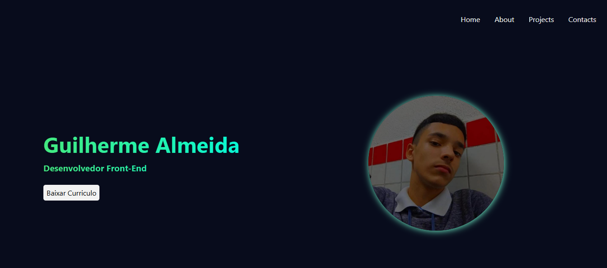

# 💼 Portfólio Pessoal 

Bem-vindo ao meu portfólio pessoal! Este projeto foi desenvolvido com o objetivo de apresentar minhas habilidades como desenvolvedor front-end, meus projetos, experiências e formas de contato de maneira clara, visual e responsiva.

## 📷 Prévia
 

## 📂 Funcionalidades
- Página inicial com apresentação pessoal
- Sessão de projetos com links para os repositórios
- Sessão de habilidades e tecnologias
- Área de contato com formulário ou links diretos
- Download do currículo em PDF

## 🚀 Tecnologias Utilizadas
- HTML5
- CSS3
- JavaScript
- Figma
- Git e Github

## 📬 Contato
- Email: guialmeida.dev@gmail.com
- LinkedIn: [linkedin.com/in/guilherme-almeida-2690782a6/](https://linkedin.com/in/guilherme-almeida-2690782a6/)
- GitHub: [github.com/GuilhermeAlmeida15](https://github.com/GuilhermeAlmeida15)

